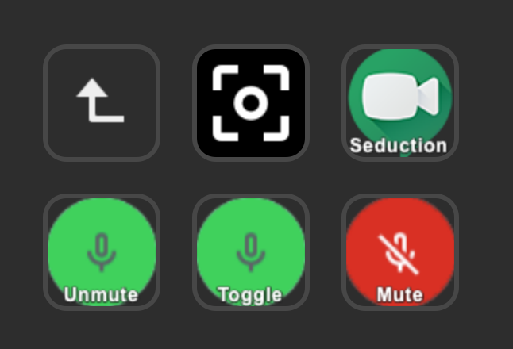

# Stream Deck Google Meet

This is 1 part of the Google Meet Stream Deck plugin. 

You will also need to install 
- the Chrome Extension: https://github.com/JeroenVdb/streamdeck-googlemeet-extension
- Chrome native messaging bridge: https://github.com/JeroenVdb/streamdeck-googlemeet-messaging-bridge

_Developed and tested on MacOS, might need some work for Windows._

## Supported actions

- Mute microphone
- Unmute microphone
- Toggle microphone

